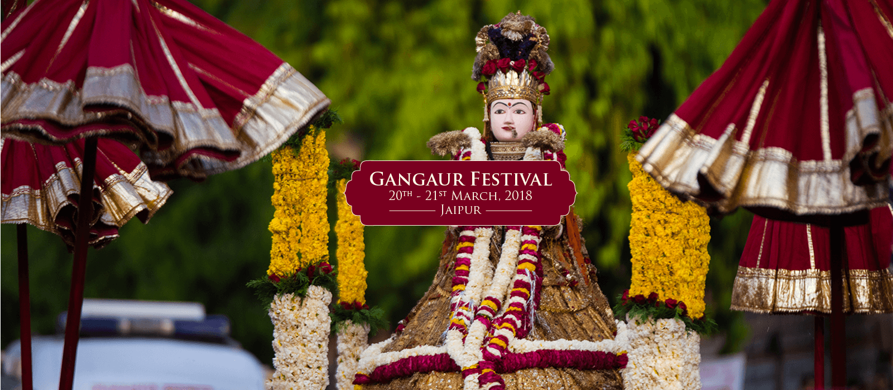

# 🏰 Rajasthan Tourism Guide

A comprehensive web application for exploring and planning trips to Rajasthan, India - the Land of Kings.



## 🌟 Features

- **🏨 Accommodation** - Find hotels, cottages, and stays
- **🍽️ Food** - Discover local Rajasthani cuisine
- **🚗 Travel** - Plan your routes and transportation
- **👤 Guide** - Hire local tour guides
- **🎯 Trainer** - Adventure and activity trainers
- **📍 Location Tracking** - Track current trip locations
- **📊 Dashboard** - User dashboard with charts and analytics
- **🗺️ Interactive Maps** - Vector maps for navigation

## 🛠️ Tech Stack

| Component | Technology |
|-----------|------------|
| Backend | PHP 7+ |
| Database | MySQL (MySQLi) |
| Frontend | HTML5, CSS3, JavaScript |
| Charts | Chart.js, Peity Charts |
| Maps | jQuery Vector Maps |
| UI Framework | Custom CSS with animations |

## 📁 Project Structure

```
Guide/
├── raj/                    # Main application
│   ├── index.html          # Landing page
│   ├── home.php            # User homepage
│   ├── login.php           # Authentication
│   ├── db.php              # Database connection (⚠️ configure)
│   ├── db.sql              # Database schema
│   ├── city visited.php    # Track visited cities
│   ├── current trip.php    # Current trip tracking
│   ├── currentlocation.php # GPS location
│   ├── assets/
│   │   ├── css/            # Stylesheets
│   │   ├── js/             # JavaScript files
│   │   │   ├── dashboard.js
│   │   │   ├── chartjs.min.js
│   │   │   └── lib/
│   │   │       ├── peitychart/
│   │   │       └── vector-map/
│   │   └── fonts/          # Icon fonts
│   ├── hotel/              # Hotel booking module
│   ├── cottage/            # Cottage listings
│   ├── guide/              # Tour guide module
│   └── book_travel/        # Travel booking
├── database/               # Additional DB files
├── Guide.pptx              # Project presentation
└── guide.zip               # Compressed backup
```

## 🚀 Installation

### Prerequisites

- PHP 7.0 or higher
- MySQL 5.7 or higher
- Apache/Nginx web server
- XAMPP/WAMP/LAMP stack (recommended)

### Setup Steps

1. **Clone the repository**
   ```bash
   git clone https://github.com/RajmaniShukla/Guide.git
   cd Guide
   ```

2. **Configure Database**
   ```bash
   # Copy the example config
   cp raj/db.example.php raj/db.php
   
   # Edit with your credentials
   nano raj/db.php
   ```

3. **Create Database**
   ```sql
   CREATE DATABASE rajasthan_tourism;
   USE rajasthan_tourism;
   SOURCE raj/db.sql;
   ```

4. **Configure Web Server**
   - Point document root to `raj/` directory
   - Or access via: `http://localhost/Guide/raj/`

5. **Access the Application**
   ```
   http://localhost/Guide/raj/index.html
   ```

## 🗄️ Database Schema

### Users Table
```sql
CREATE TABLE users (
  id INT(11) NOT NULL AUTO_INCREMENT,
  name VARCHAR(240) NOT NULL,
  email VARCHAR(240) NOT NULL,
  password VARCHAR(240) NOT NULL,
  date TIMESTAMP DEFAULT CURRENT_TIMESTAMP,
  PRIMARY KEY (id)
);
```

## ⚙️ Configuration

### Database Connection (`db.example.php`)
```php
<?php
$db_host = 'localhost';
$db_user = 'your_username';
$db_pass = 'your_password';
$db_name = 'rajasthan_tourism';

$connection = mysqli_connect($db_host, $db_user, $db_pass, $db_name);

if (!$connection) {
    die("Connection failed: " . mysqli_connect_error());
}
?>
```

## 🏛️ Rajasthan Highlights

Explore the rich heritage of Rajasthan:

| City | Attractions |
|------|-------------|
| **Jaipur** | Hawa Mahal, Amber Fort, City Palace |
| **Udaipur** | Lake Pichola, City Palace, Jag Mandir |
| **Jodhpur** | Mehrangarh Fort, Umaid Bhawan Palace |
| **Jaisalmer** | Golden Fort, Sam Sand Dunes |
| **Pushkar** | Brahma Temple, Pushkar Lake |
| **Mount Abu** | Dilwara Temples, Nakki Lake |

## 🎪 Festivals Covered

- 🐪 Pushkar Camel Fair
- 🎨 Gangaur Festival
- 🪁 International Kite Festival
- 🏜️ Desert Festival (Jaisalmer)
- 🎭 Teej Festival

## 🔒 Security Notes

⚠️ **Important Security Considerations:**

1. **Never commit `db.php` with real credentials**
2. Use environment variables in production
3. Implement prepared statements to prevent SQL injection
4. Hash passwords using `password_hash()` and `password_verify()`
5. Add CSRF protection to forms
6. Validate and sanitize all user inputs

### Recommended Security Improvements

```php
// Use password hashing
$hashed_password = password_hash($password, PASSWORD_DEFAULT);

// Use prepared statements
$stmt = $connection->prepare("SELECT * FROM users WHERE email = ?");
$stmt->bind_param("s", $email);
$stmt->execute();
```

## 🌐 Live Features

- **Responsive Design** - Works on mobile and desktop
- **Animated UI** - Smooth CSS animations on hover
- **Sticky Navigation** - Easy section navigation
- **Interactive Maps** - Vector maps with country overlays

## 📸 Screenshots

### Landing Page
The landing page features a beautiful Rajasthan backdrop with navigation tabs for:
- Accommodation
- Food
- Travel
- Guide
- Trainer

### Dashboard
User dashboard includes:
- Trip statistics
- Visited cities map
- Booking history
- Activity charts

## 🤝 Contributing

1. Fork the repository
2. Create your feature branch (`git checkout -b feature/AmazingFeature`)
3. Commit your changes (`git commit -m 'Add some AmazingFeature'`)
4. Push to the branch (`git push origin feature/AmazingFeature`)
5. Open a Pull Request

## 📄 License

This project is open source and available for educational purposes.

## 👤 Author

**Rajmani Shukla**
- GitHub: [@RajmaniShukla](https://github.com/RajmaniShukla)

## 🙏 Acknowledgments

- Rajasthan Tourism Department
- jQuery and Chart.js communities
- All contributors

---

<p align="center">
  <b>🏰 Padharo Mhare Desh - Welcome to Rajasthan! 🏰</b>
</p>
